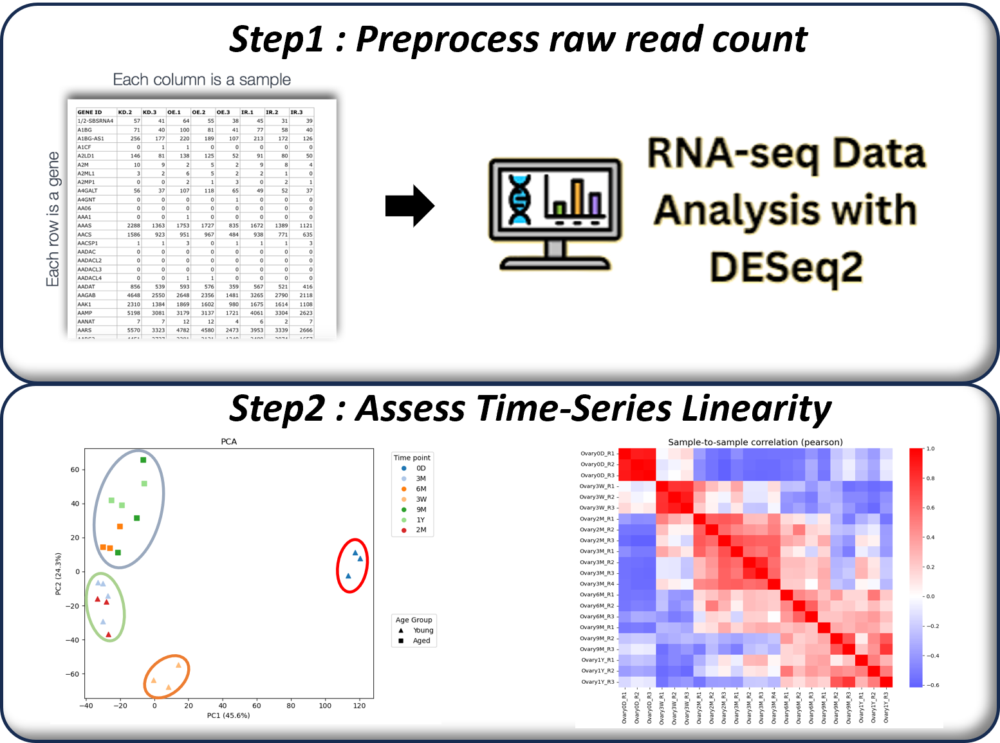
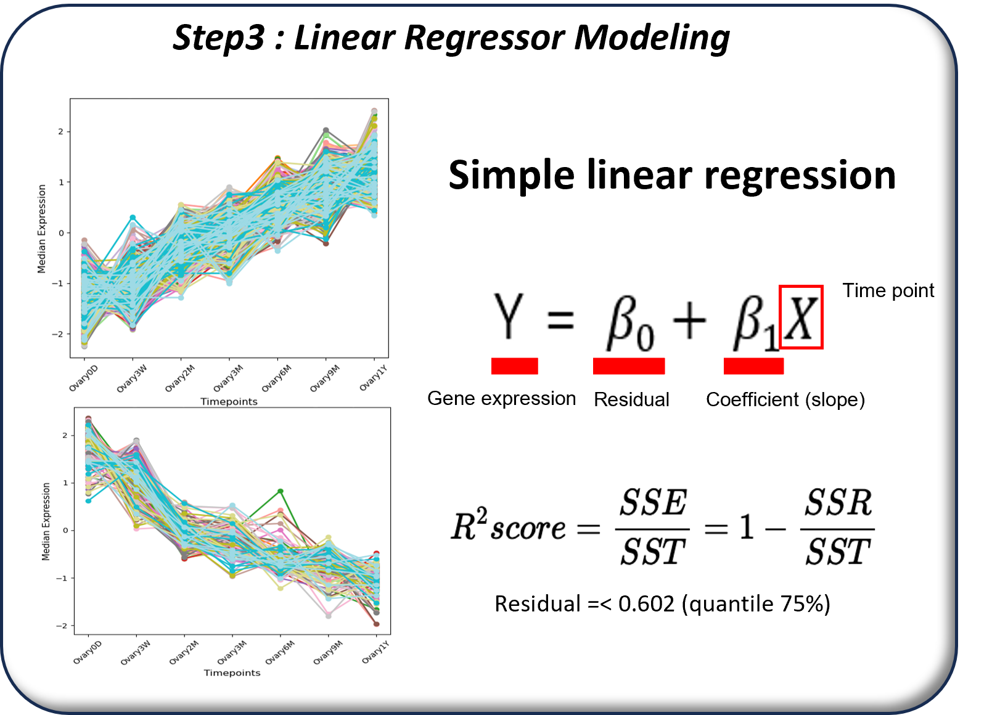

# Pipeline of Time-Series Pathway Identification

## Overview

Conventional bulk RNA-seq pathway analysis depends on pairwise differential-expression testing and cannot reliably identify pathways whose activity changes progressively over a time series. This project introduces a temporal modeling pipeline that identifies linearly increasing and decreasing gene programs before pathway enrichment.

## Workflow

### 1. Preprocess bulk RNA-seq counts

Raw read-count data were processed with DESeq2 to produce normalized expression profiles suitable for time-series modeling.

### 2. Assess time-series linearity

A Pearson sample-correlation matrix and its eigenvalue structure were used to assess whether the samples followed a temporal trajectory. Principal-component analysis confirmed sequential alignment of samples along the temporal progression, supporting linear equation-based modeling.

### 3. Model temporal gene-expression programs

For each gene, expression was modeled across time points with simple linear regression. Genes with residuals below the 75th percentile were retained as temporally linear genes. Positive and negative slopes were modeled separately to create progressively upregulated and progressively downregulated gene sets.

### 4. Validate pathway-level results

The resulting gene sets were evaluated with enrichment scores and pathway analysis. Their ability to reproduce known aging-associated immune, inflammation, epigenetic-modification, fertilization, and cell-cycle programs supported the temporal-modeling approach.

## Methods

- Bulk RNA-seq preprocessing with DESeq2
- Pearson correlation and principal-component analysis
- Simple linear regression and residual filtering
- Positive- and negative-slope gene-set construction
- Gene-set enrichment and pathway validation

## Key Finding

Temporal linear modeling recovered biologically relevant age-associated pathways that are difficult to capture with conventional pairwise DEG-based pathway analysis.

