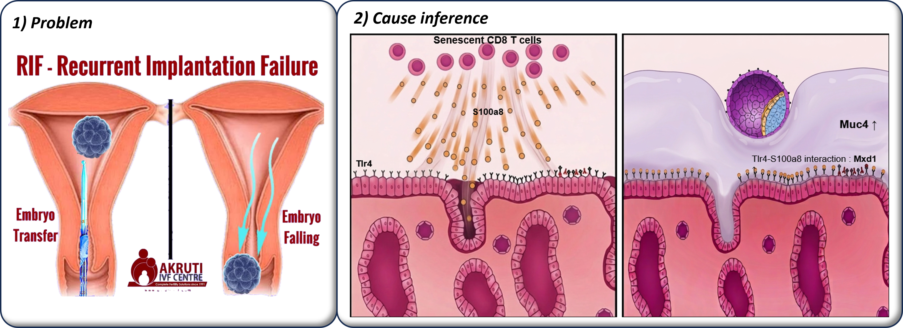
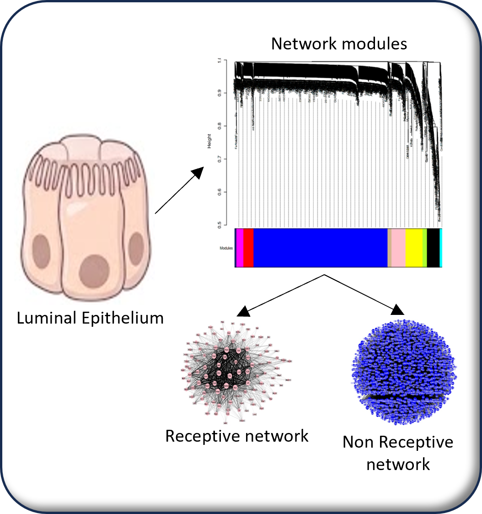
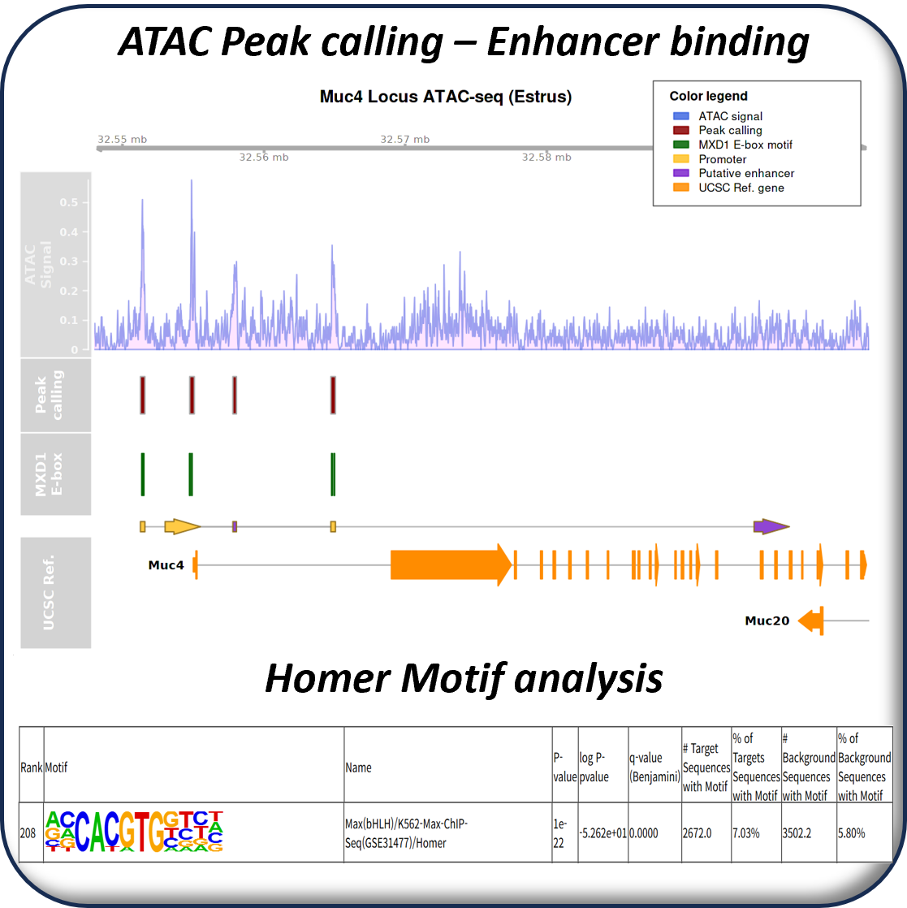
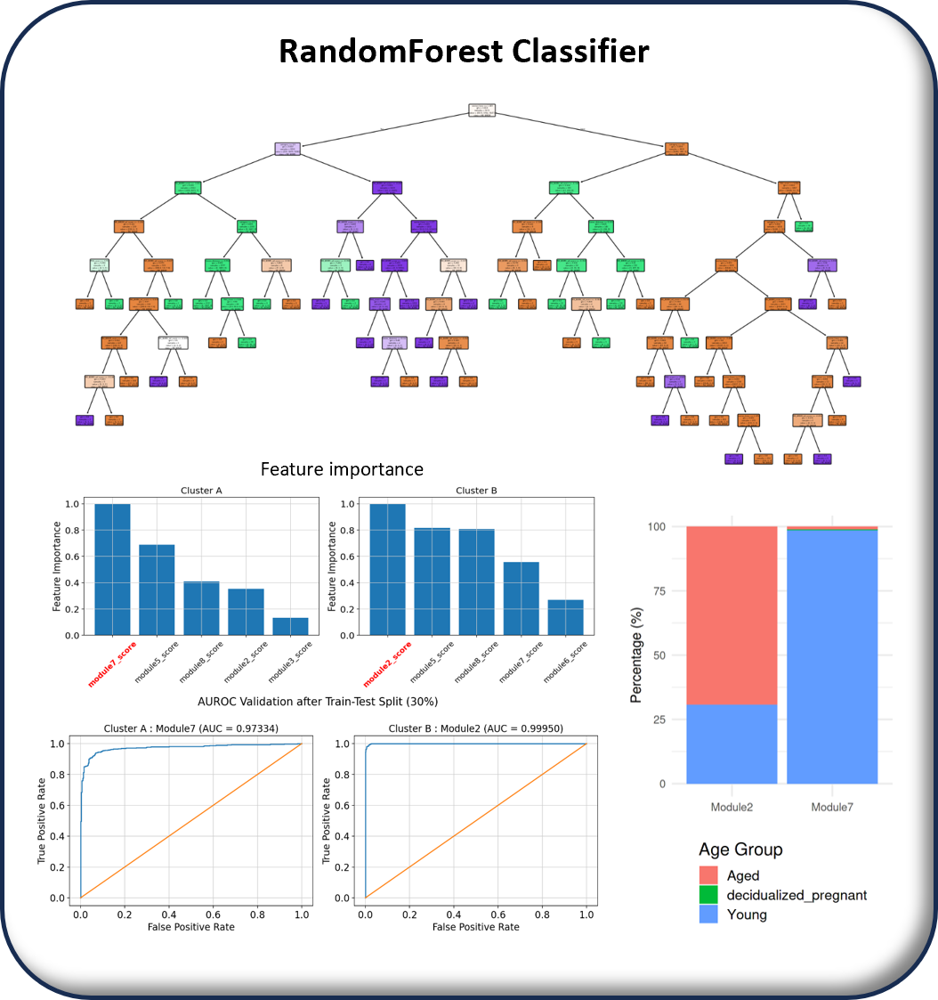
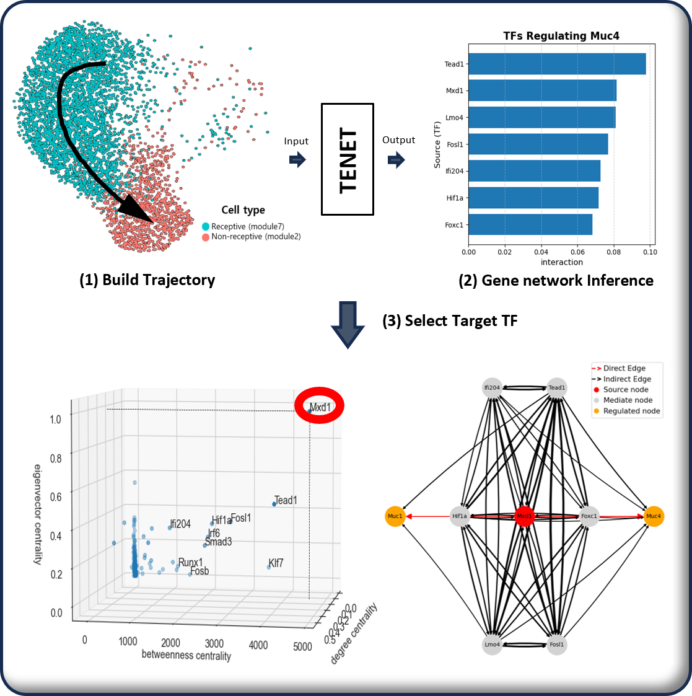
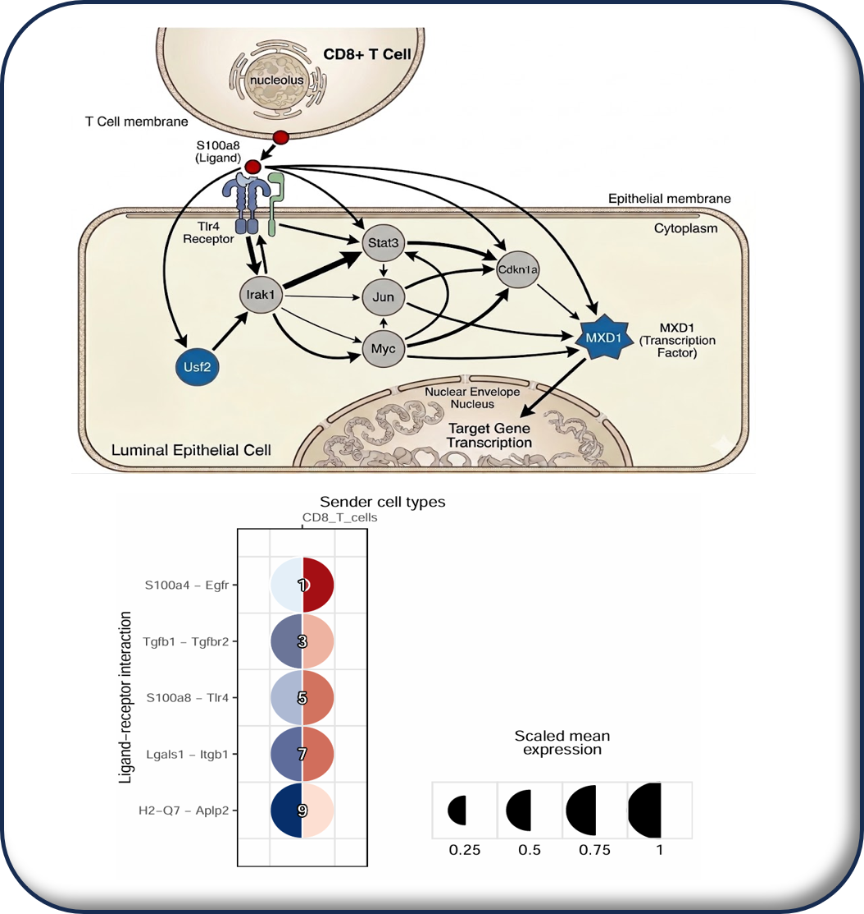
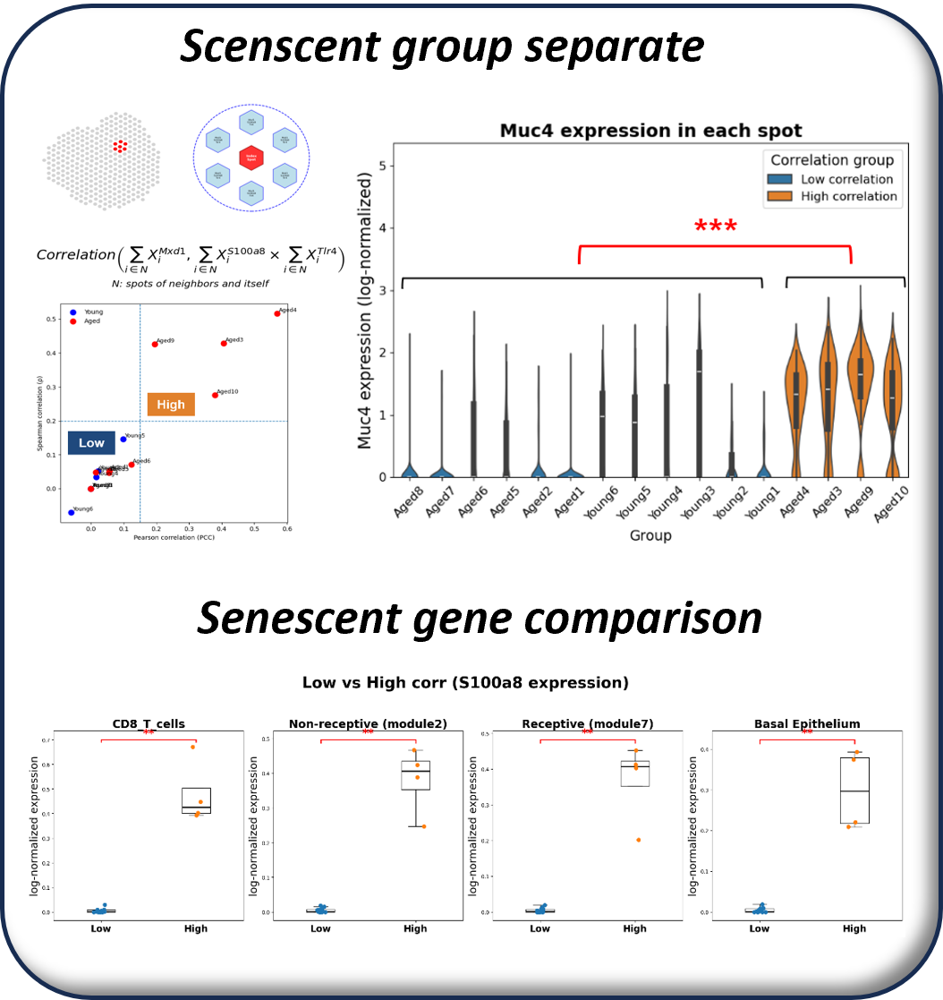

# Implantation Failure in Uterine Aging

## Objective

Determine how uterine aging produces a non-receptive endometrial state and recurrent implantation failure, focusing on senescent CD8 T-cell signaling and mucin overexpression.

## Workflow

### 1. Define receptive and non-receptive endometrial networks

Luminal epithelial scRNA-seq profiles were grouped into regulatory modules. The figure separates a receptive network from a non-receptive network; mucin-associated genes are concentrated in the latter.

### 2. Classify network states and prioritize transition factors

The shared ensemble Random Forest model classifies the two network modules. Its feature-importance and ROC-AUC panels support the separation, and the age-composition bar plot shows that the non-receptive module is enriched in aged uterus samples.

TENET models the trajectory from receptive to non-receptive cells, reconstructs the transition network, and ranks regulators by graph metrics. Mxd1 is prioritized as a candidate driver of the mucin-associated transition.

### 3. Infer immune-to-epithelial signaling

The NicheNet network traces CD8 T-cell ligands, including S100a8, to luminal epithelial receptor pathways and Mxd1 activation. This connects senescent immune signaling to the non-receptive epithelial program.

### 4. Validate across spatial and epigenomic data

The spatial figure stratifies spots by local CD8 T-cell and epithelial-signal correlation; high-correlation spots show higher Muc4 expression and senescence-associated signals. The ATAC-seq figure then shows accessible peaks, an Mxd1 motif, and putative enhancer locations at the Muc4 locus, providing epigenomic support for the proposed mechanism.

## Methods

- scRNA-seq and spatial transcriptomics
- Gene regulatory network construction and scWGCNA
- Ensemble Random Forest classification and feature importance
- Pseudotime and TENET network-transition inference
- NicheNet cell-cell communication analysis
- ATAC-seq peak calling and HOMER motif enrichment

## Key Finding

Senescent CD8 T-cell signaling is associated with an Mxd1-linked transition to a mucin-overexpression, non-receptive luminal epithelial network, providing a potential mechanism for implantation failure in uterine aging.

