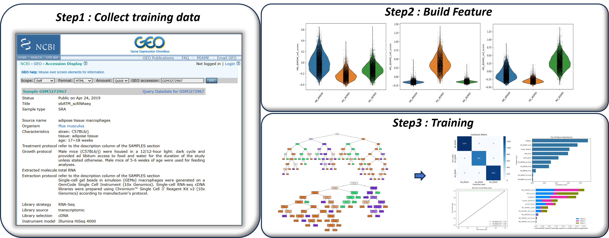
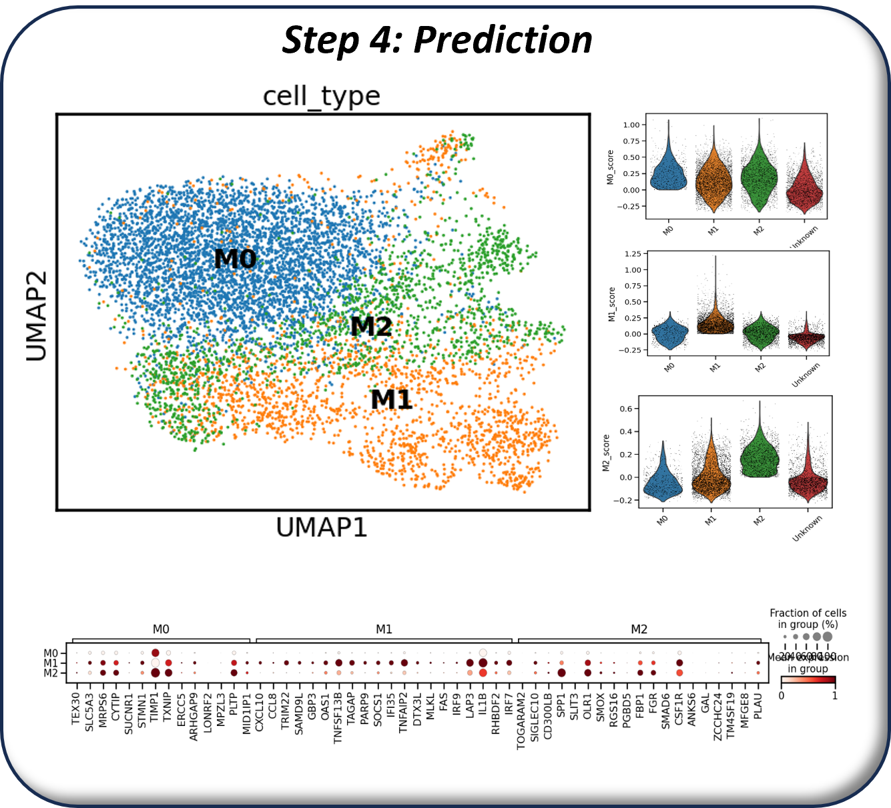
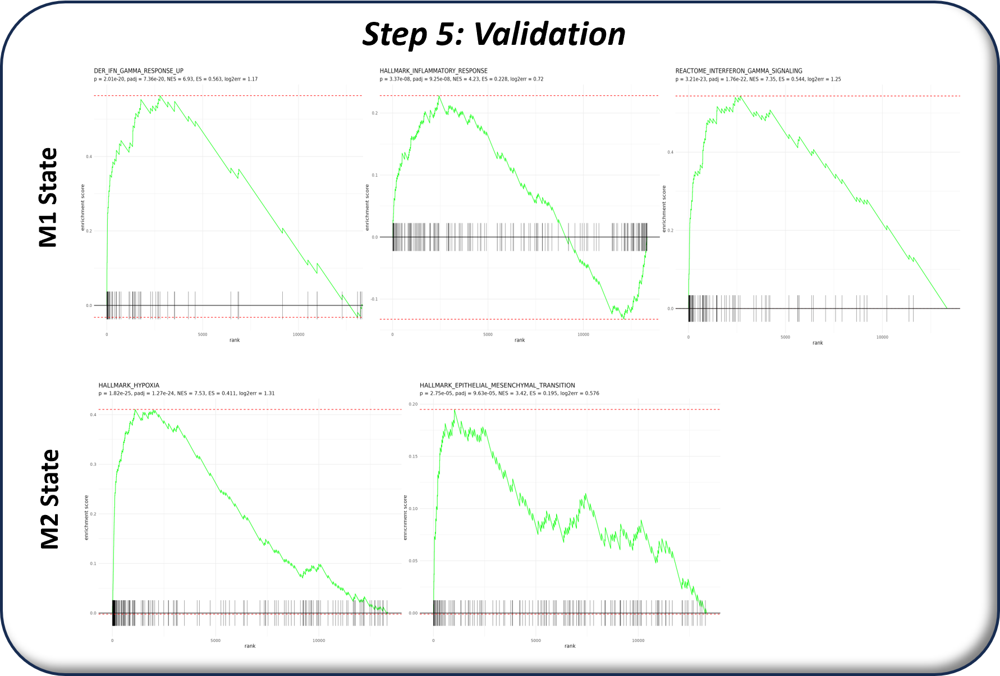

# Developing a TME Immune Cell Annotation Tool

## Overview

The tumor microenvironment (TME) is highly heterogeneous, making marker-based annotation of myeloid cells difficult. This project develops a machine-learning workflow that uses public single-cell RNA-seq data to annotate heterogeneous myeloid populations and characterize the immune landscape.

## Workflow

### 1. Training-data collection and feature construction

Public scRNA-seq datasets were collected as training data. Features were constructed from expression programs that distinguish myeloid states, then evaluated for their contribution to classification.

### 2. Ensemble classification

An ensemble Random Forest classifier was trained using the selected features. Feature importance, confusion matrices, and ROC-AUC curves were used to evaluate the classifier and refine the predictive feature set.

### 3. Prediction in human single-cell data

The trained model was applied to human scRNA-seq data to label myeloid populations, including M0, M1, and M2 states. The resulting annotations were evaluated with UMAP structure and marker-gene expression.

### 4. Biological validation

Predictions were validated through enrichment analysis, pathway activity, and established gene markers. The M1 and M2 assignments showed distinct inflammatory, hypoxia, epithelial-mesenchymal-transition, and interferon-gamma response programs.

## Methods

- Public scRNA-seq training data integration
- Feature construction and importance ranking
- Ensemble Random Forest classification
- Confusion-matrix and ROC-AUC evaluation
- UMAP, marker-gene, pathway, and enrichment validation

## Key Finding

The classifier transferred informative myeloid-state features from public reference data to human TME data and produced biologically supported myeloid annotations.

