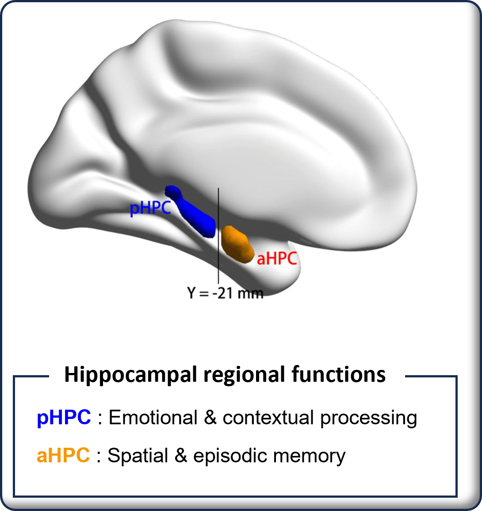
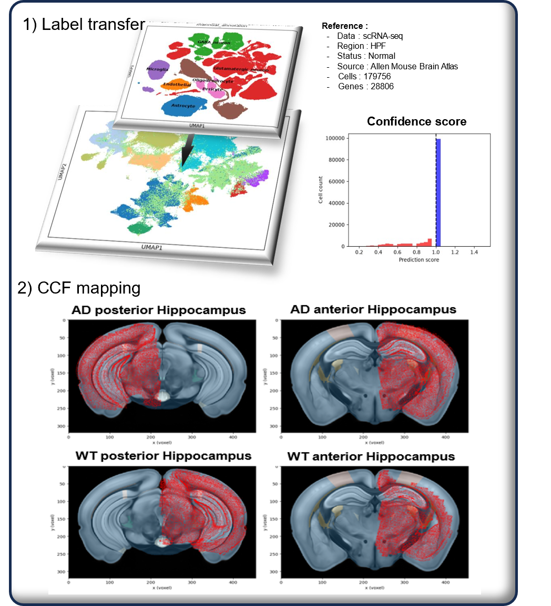
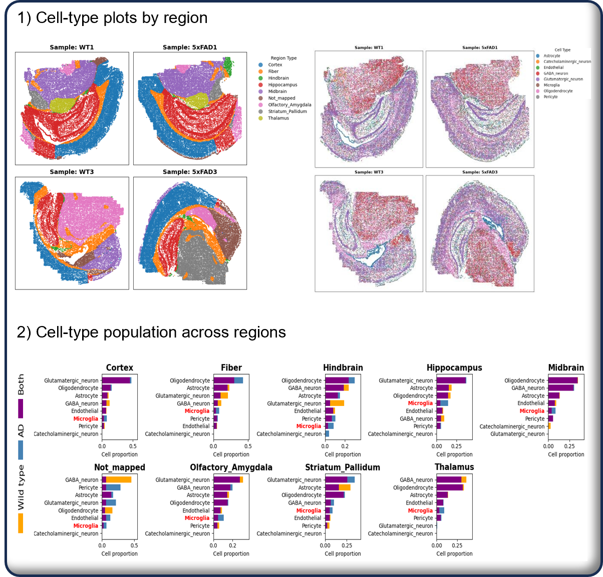
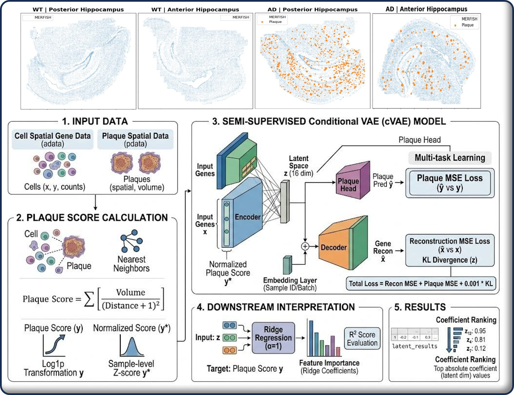
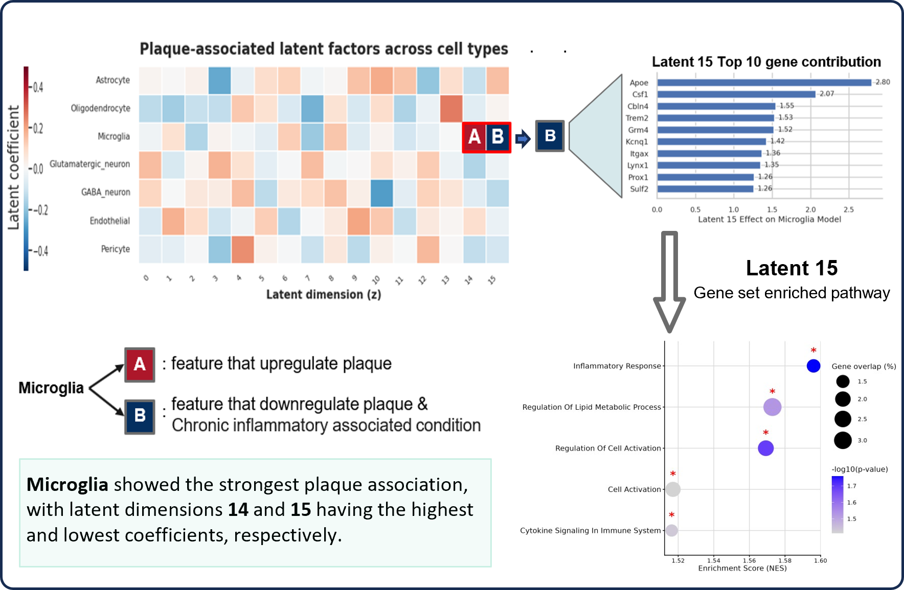
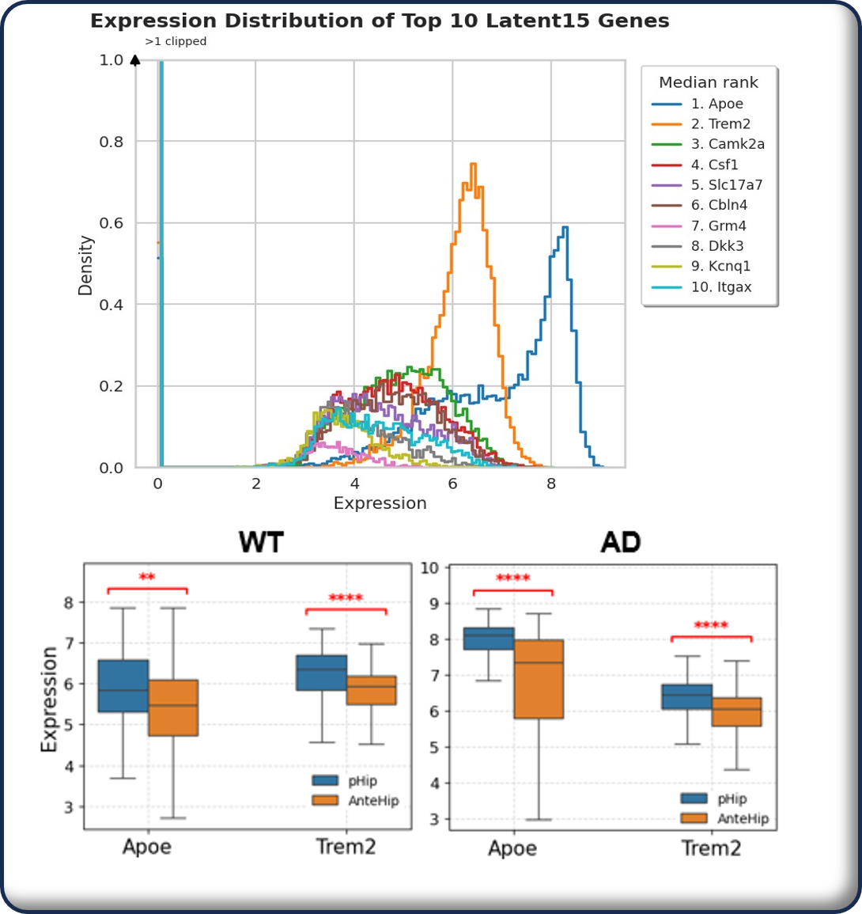
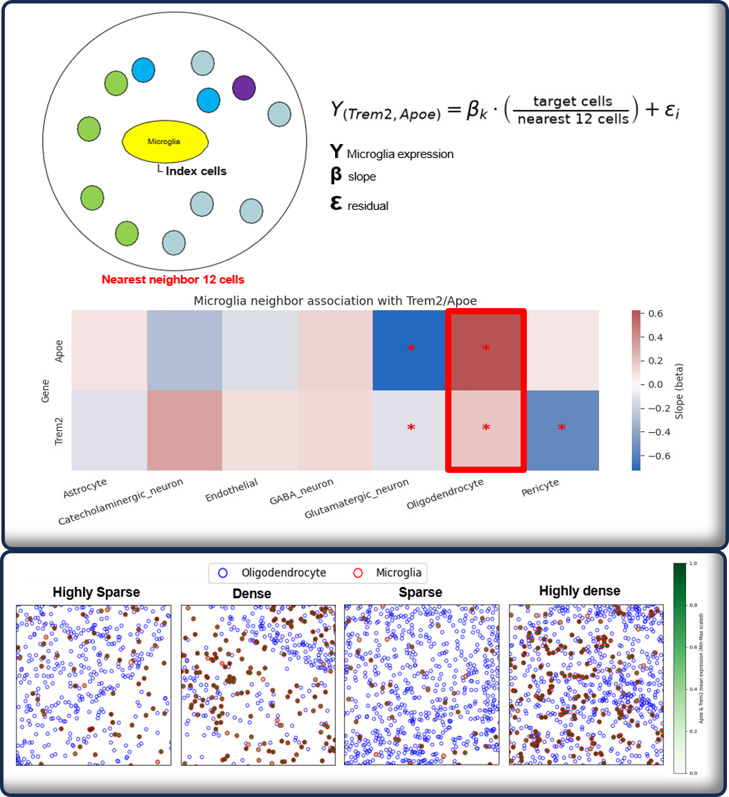
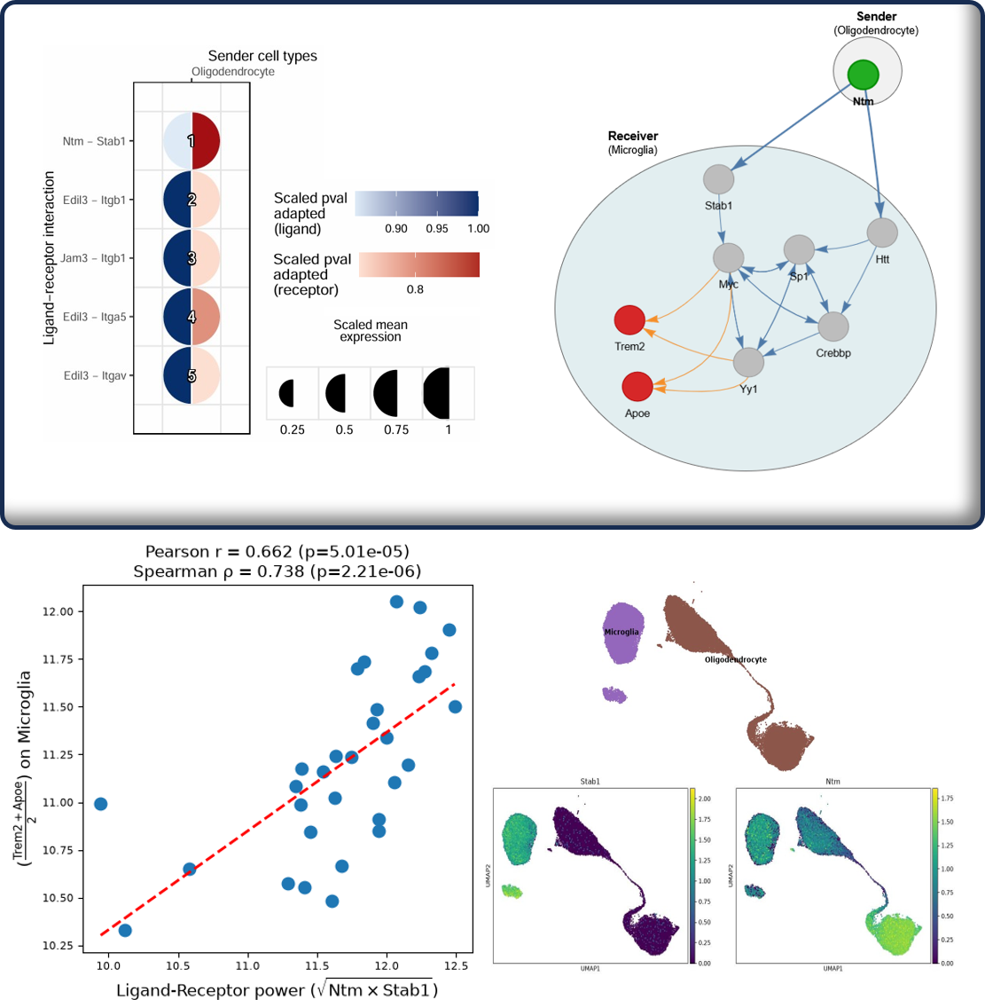

# Predicting Hippocampal Regional Vulnerability in Alzheimer's Disease

## Objective

Identify the hippocampal region and cell program most vulnerable to Alzheimer's disease by integrating spatial annotation, plaque-associated latent modeling, and cell-cell interaction analysis.

## Workflow

### 1. Spatial annotation and regional comparison

The first figure defines the posterior hippocampus (pHPC; emotional and contextual processing) and anterior hippocampus (aHPC; spatial and episodic memory). The second figure maps spatial cells to an Allen Mouse Brain Atlas scRNA-seq reference and to CCF regions, creating comparable pHPC and aHPC regions in AD and wild-type samples.

The regional cell-type plots and population bars show increased microglia in AD across mapped regions, motivating microglia-centered plaque and vulnerability analysis.

### 2. Plaque-associated latent-factor modeling

The figure shows how plaque size and nearest-cell distance are converted to a plaque score, then supplied with spatial gene expression to a conditional VAE. Ridge regression ranks latent dimensions by their association with the plaque score for each cell type.

Microglia have the largest plaque-associated latent coefficients. The decoding figure contrasts plaque-upregulating and plaque-downregulating factors and highlights z15, whose decoded genes are enriched for lipid metabolism and chronic inflammatory signaling.

### 3. Regional vulnerability and cell-cell interactions

The density and boxplot figure prioritizes decoded z15 genes. APOE and TREM2 were retained because of their established AD relevance and show higher expression in the posterior hippocampus, indicating greater pHPC vulnerability.

Nearest-cell regression links local oligodendrocyte density to microglial TREM2/APOE expression. The final figure uses NicheNet and pseudobulk correlation to reproduce ligand-receptor signals regulating this microglial program in scRNA-seq data.

## Methods

- Spatial transcriptomics and MERFISH data analysis
- Reference label transfer with scVI and CCF mapping
- Conditional variational autoencoder and ridge regression
- Latent-space gene-set decoding and pathway enrichment
- Nearest-cell regression, NicheNet, and pseudobulk validation

## Key Finding

The posterior hippocampus showed higher APOE and TREM2 expression in microglia, consistent with greater AD-related regional vulnerability and a plaque-associated chronic inflammatory program.

