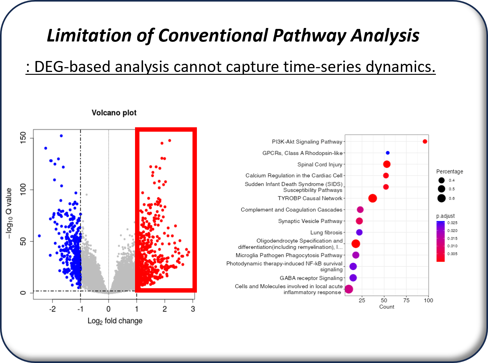
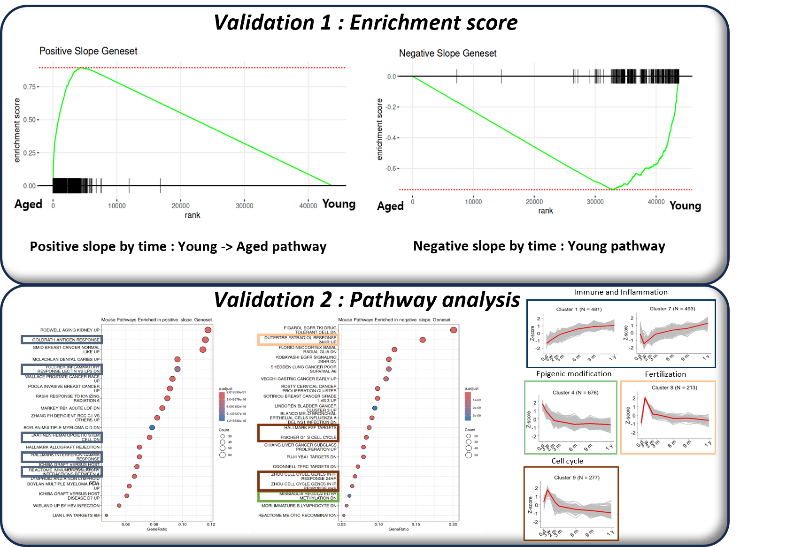

# Pipeline of Time-Series Pathway Identification

## (1) Introduction and (2) Pipeline

Conventional bulk RNA-seq pathway analysis identifies DEGs through pairwise comparisons (e.g., one-vs-one or one-vs-others), followed by gene set generation and pathway enrichment analysis. However, this approach cannot effectively identify pathways with progressively increasing activity across a time series.

To assess the linearity of the time-series data, I constructed a Pearson correlation matrix and evaluated its eigenvalue structure. PCA further confirmed a clear temporal trajectory, with samples sequentially aligned along the principal components. This supported the use of linear equation-based modeling to characterize the temporal dynamics of the data.

**Keyword:** Bulk RNAseq, DEG, DESeq2, Pathway enrichment, Linearity, Linear algebra, Public data

## (3) Pipeline and (4) Validation

Gene expression was modeled using linear regression across time points, and genes with residuals below the 75 percentile were retained. By modeling positive and negative slopes separately, two temporally linear gene sets were generated, representing progressively upregulated and downregulated genes, respectively.

The resulting gene sets were validated by calculating pathway enrichment scores and comparing them with previously reported aging-associated pathways. Successful reproduction of known aging-related pathways demonstrated the validity of the proposed approach, supporting a novel methodology for constructing pathways through temporal modeling rather than conventional DEG-based analysis.

Positive slope by time : Young -> Aged pathway  
Negative slope by time : Young pathway  
Residual =< 0.602 (quantile 75%)

**Keyword:** Bulk RNAseq, Geneset modeling, Pathway enrichment, Linearity, Linear algebra, Validation

