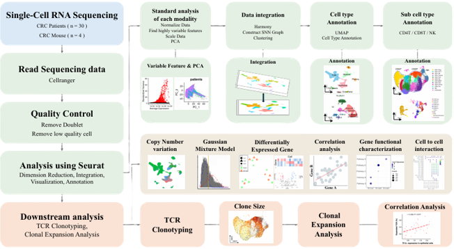
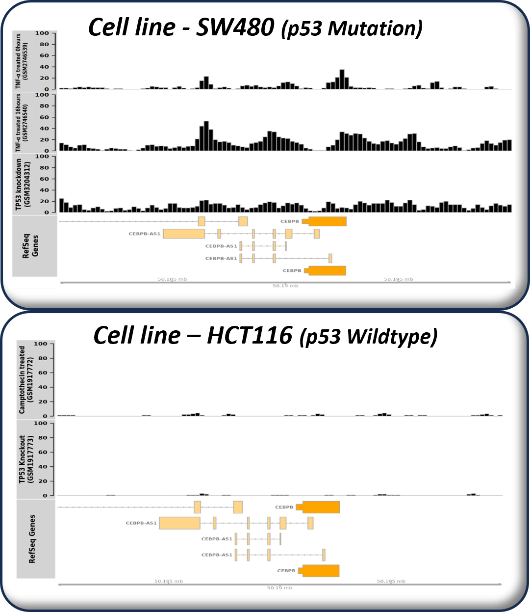
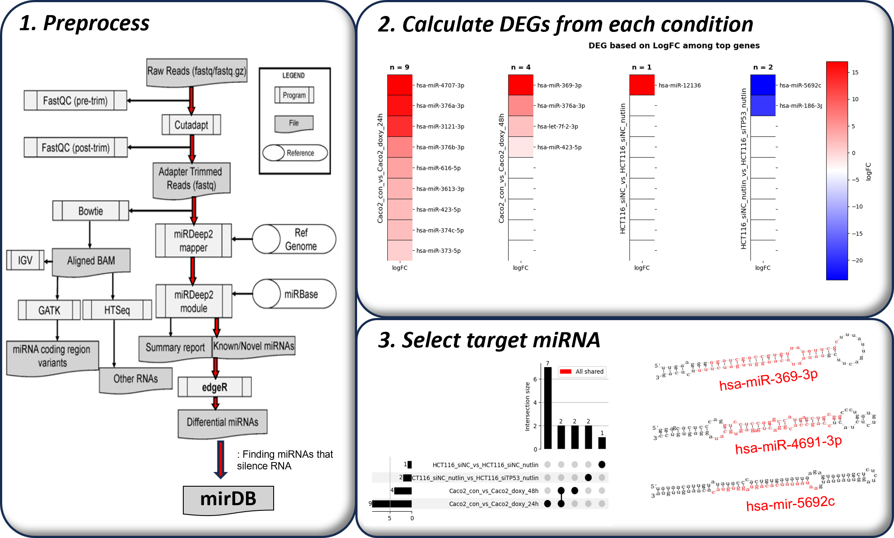
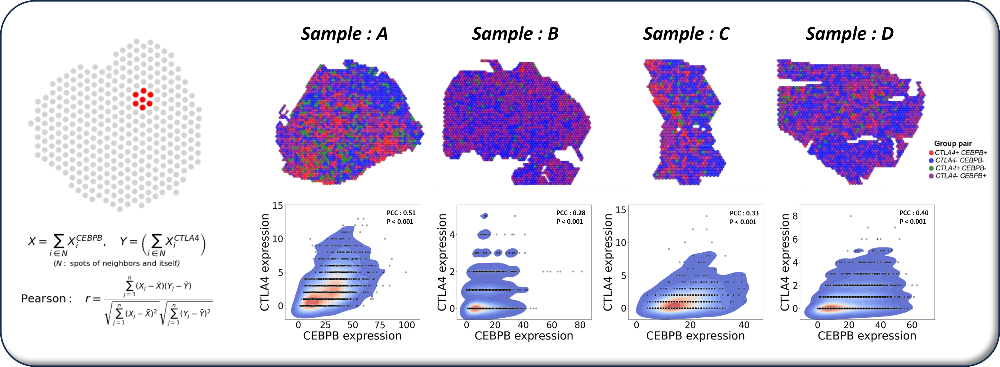

# Immune Evasion in Colorectal Cancer

## Objective

Investigate why microsatellite-stable colorectal cancer shows limited response to immune-checkpoint inhibitors, focusing on a TP53 loss-associated CEBPB-CTLA4 immune-evasion axis.

## Analysis Workflow

### 1. Single-cell immune profiling

The figure summarizes the discovery workflow: Cell Ranger processing, quality control, Seurat integration, cell-type and T-cell subtype annotation, followed by CNV, Gaussian mixture, differential-expression, correlation, cell-cell interaction, and TCR clonal-expansion analyses. This established the immune-cell context used to nominate the CEBPB-CTLA4 relationship.

### 2. ChIP-seq validation of the regulatory relationship

The upper track shows TP53-mutant SW480 cells and the lower track shows TP53-wild-type HCT116 cells at the CEBPB locus. The stronger binding pattern in the mutant context provides orthogonal support for the TP53-associated regulatory state identified in the single-cell data.

### 3. miRNA analysis

The left panel traces the miRNA workflow from read preprocessing through miRDeep2 and edgeR. The right panels compare condition-specific miRNAs and prioritize shared candidate regulators with miRDB, including hsa-miR-369-3p, hsa-miR-4691-3p, and hsa-miR-5692c.

### 4. Spatial coexpression validation

Each pseudo-spot aggregates a Visium spot and its first-layer neighbors. Across samples A-D, local CEBPB and CTLA4 expression was positively correlated (PCC = 0.28-0.51; P < 0.001), reproducing the proposed relationship in spatially resolved tissue.

## Methods

- scRNA-seq, TCR clonotyping, and clonal-expansion analysis
- Bulk RNA-seq and cancer-genome analysis
- p53 ChIP-seq, peak calling, and HOMER motif analysis
- miRNA differential expression with edgeR and miRDB prioritization
- 10x Visium spatial transcriptomics and sliding-window coexpression analysis

## Key Finding

The analyses support a TP53 loss-associated CEBPB-CTLA4 axis as a candidate mechanism of immune evasion and immunotherapy resistance in colorectal cancer.

